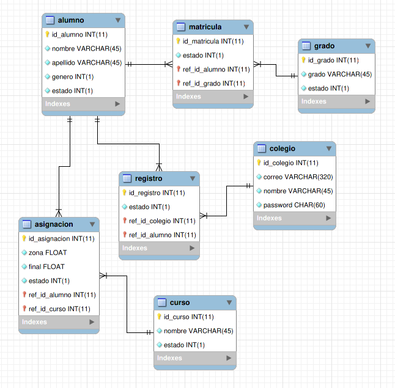

Parte práctica - Sistema de Control de Asignaciones - Infile
============

Datos:

  * **Nombre:** Marvin José Calderón García
  
------------

La parte práctica consiste en:

Se le solicita desarrollar un sistema para llevar el control de asignacion de cursos de los alumnos de un colegio, dicho sistema debe llevar control de la zona y nota final en cada uno de los cursos asignados. Tomar en cuenta que el sistema se le renta a diferentes colegios.
Debe entregar lo siguiente:
1. Diagrama ER
2. Diagramas UML que ud considere necesarios (opcional)
3. Crear las siguientes consultas:
 * Listar todos los alumnos del colegio DEMO1 que esten en primero, segundo y tercero primaria
 * Listar promedio de calificaciones de los alumnos de 2do primaria del colegio DEMO2
 * Listar todos lo alumnos del colegio DEMO2 cuya nota final en matematica es mayor a 90, agrupador por grado, sexo
4. Cronograma de actividades y tiempos estimados (Debe entregarlo para revision antes de iniciar el desarrollo)
5. CRUD

------------ 

Requisitos
------------

Los requisitos necesarios para hacer funcionar esta práctica son:

1. Tener instalado [Docker](https://www.docker.com/) & [Docker-Compose](https://docs.docker.com/compose/).  Para ello, se puede seguir el tutorial que está en el siguiente [enlace](https://phoenixnap.com/kb/install-docker-compose-ubuntu).
    
2. Una vez instalado lo necesario en el punto anterior se debe clonar este repositorio y colocarlo en una ruta de su preferencia.  En una terminal, se podría llevar a cabo de la siguiente manera:
    ~~~
    $ cd /home/$USER
    $ git clone https://github.com/MCXDeveloper/Infile_PartePractica.git
    $ cd Infile_PartePractica
    ~~~

4. Una vez finalizado todo lo anterior, se puede pasar a la parte de funcionamiento.

------------

Funcionamiento de la aplicación usando Docker-Compose
------------

Dentro de la carpeta que genera el clonado de este repositorio, se encuentra un archivo con el nombre de **docker-compose.yml**.  Este archivo se encarga de descargar una imagen de node de docker y montar los volúmenes necesarios para levantar 2 containers que son:
  * El container de la aplicación (NodeJS y Express)
  * El container de la base de datos (MySQL)

Para llevar a cabo este proceso, únicamente es necesario correr el siguiente comando:
~~~
$ docker-compose up
~~~

Al finalizar se deben mostrar que los 2 servicios fueron levantados.  Para acceder al servicio de la app se debe acceder a http://localhost:3000

------------

Flujo de la aplicación
------------

Una vez ingresado a la página principal de la aplicación se pueden utilizar 3 usuarios (que fueron creados para poder probar las funcionalidades) los cuales son:

1. *Usuario administrador:*
    * Correo: admin@infile.com
    * Contraseña: admin

2. *Usuario - Colegio - DEMO1:*
    * Correo: demo1@gmail.com
    * Contraseña: demo1

3. *Usuario - Colegio - DEMO2:*
    * Correo: demo2@gmail.com
    * Contraseña: demo2

Con el usuario administrador se puede revisar el funcionamiento de las 3 consultas solicitadas.

Con los usuarios demo se puede revisar el funcionamiento CRUD de diferentes elementos como alumno, matricular un alumno a un grado/curso, asignar notas a los diferentes alumnos con respecto a un grado y un curso, etc.

------------

Diagrama del modelo relacional
------------

------------

License
------------
Free Software.